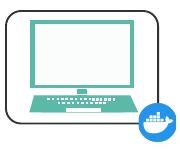
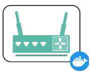
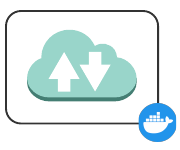
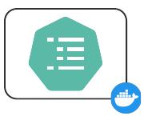
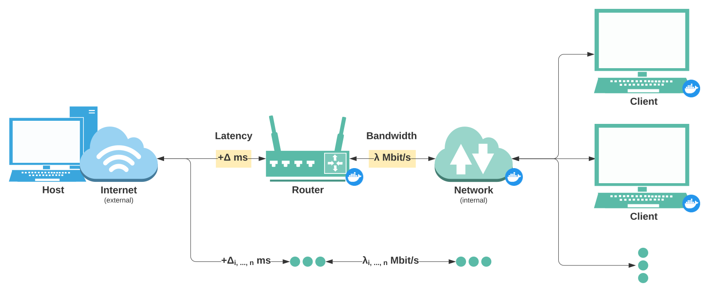
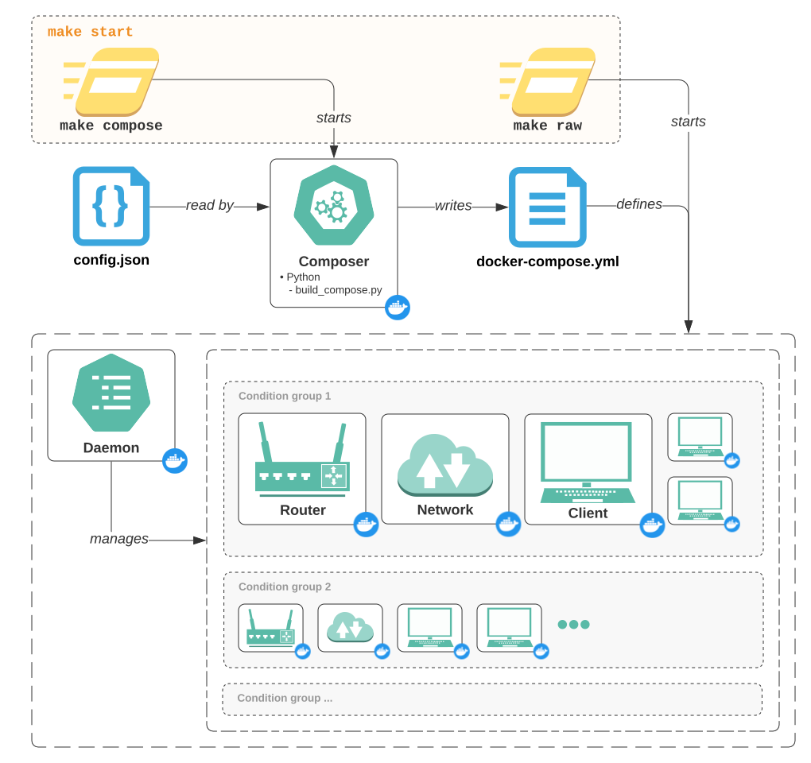

# How It Works

When DANE is run, it utilizes a handful of [Services](#services) (Docker containers and networks) to conduct the various aspects of automated network traffic generation and collection.

For each set of network conditions you've configured, these services are assembled into a specific [Networking Layout](#networking-layout) which enables multiple sets of conditions to run side by side on your computer.

All of these services and layouts are defined from your configuration using a [Configuration Pipeline](#configuration-and-tool-pipeline).

## Services

There are four main types of Docker services that are used while the tool is running. Each service has its own responsibilities, and if it's a container it comes with its own image supporting specific software dependencies.

### Client

'Client' containers act like internet users, they use the Internet and create the raw data like a person would.

#### Responsibilities

- Engage in behavior that produces network traffic -- like browsing the web or watching videos
- Collect the network traffic data by using a tool -- like [network-stats](https://github.com/Viasat/network-stats/) (currently used) or [TShark](https://tshark.dev/)
- Do anything else an end-user might do -- like connecting to a VPN or running background software services

#### Software

Clients have software that enables them to access the internet and use it. Each client generates and collects its own network traffic data in isolation from the other clients. This approach enables a high degree of parallelization in data collection.

- Firefox -- web browser
- Selenium -- web automation, uses the Python API
- Python -- run arbitrary scripts like [network-stats](https://github.com/Viasat/network-stats/) and [starter-scripts](https://github.com/dane-tool/starter-scripts/)
- iproute2 -- connect to the router
- Speedtest -- check achieved network conditions
- OpenConnect -- connect to a VPN

Since the Dockerfile which defines these software dependencies is kept locally, it is very easy to specify additional software to run on the clients.

#### Usage

During a tool run, a client is created for each combination of *behavior* and *condition* specified in your configuration.

---
### Router

'Router' containers act like their physical namesake, they only care about networking.

#### Responsibilities

- Route communications between clients and the Internet
- Configure the network conditions for clients connected to it -- emulate conditions like latency and bandwidth

#### Software

The only software needed for a router is to route packets and emulate conditions.

- iptables -- to route packets between the internal network and the Internet
- iproute2 -- includes `tc` (traffic controller) to emulate conditions

#### Usage

During a tool run, a router is created for each *condition* specified in your configuration.

---
### Network

DANE utilizes Docker-created networks to serve as the connection between clients and routers. This allows for multiple different network conditions to be present on a single local machine (the "host") while still remaining isolated from each other and not affecting the host's network connection.

As networks are not containers, they do not have any software or responsibilities -- other than to just exist!

#### Usage

During a tool run, a network is created for each *condition* specified in your configuration.

---
### Daemon

The 'daemon' container acts as a manager to all other containers. The daemon tells all other containers when to run their commands and scripts, and is therefore at the core of the automation capabilities of this tool.

#### Responsibilities

- Instruct routers to set up conditions based on configuration
- Instruct clients to run behaviors scripts based on configuration, and to run collection scripts
- Instruct clients to run additional commands like VPN connections or additional software
- Interrupt and tear down all containers when tool use is finished

#### Software

The daemon doesn't do much on its own, but it needs to be able to manage other Docker containers.

- Docker
- Python -- uses the Docker API and runs the management script

#### Usage

During a tool run, a single daemon is created.

## Networking Layout

To create effective, realistic looking network emulation which supports Linux *and* Windows and Mac (both of which have an additional virtualization layer which renders many network emulation attempts futile), we essentially mimic a real world home network setup with our Docker services.

### Network interfaces
Client containers only have a network interface connected to an internal Docker-created network, and use their assigned router as their default gateway.

Routers have interfaces connected to both the internal network and the external Internet.

Nothing ever effects your local machine's interface with the Internet (although if you have multiple 'people' streaming videos on your home network you'll still probably see your speeds drop -- they are ultimately using your internet connection, after all!).

### Emulating conditions
This layout allows the router to exhibit fine control over the network conditions seen by the clients. The router can control latency, packet loss, or other packet-level conditions on their interface to the Internet, which in turn dictates how packets arrive to the internal network.

Furthermore, the router can limit the rate of packet flow egress on their interface connected to the internal network. If the router limits the rate it allows itself to send packets to the internal network, then to clients this appears like a bandwidth restriction to download speeds! (This is exciting because ingress bandwidth limiting is traditionally not possible without an [IFB device](https://wiki.linuxfoundation.org/networking/ifb), which neither Windows nor Mac containers support.)

## Configuration and Tool Pipeline

Below we'll get a sense of how the entire tool is run when you issue a `make start` command, starting with your configuration file and ending up with the whole slew of services and networking layout we discussed above.

Let's work backwards.

### Deployed services
Within each condition group we have the network layout seen above, each with a unique latency and bandwidth combination specified in your *conditions* config, and with a client container for each behavior in your *behaviors* config.

All of these groups of routers, networks, and clients are managed by the daemon -- which tells the routers to set up their target conditions and tells the clients to connect to each of their respective routers, start their behavior scripts, and start collecting data, etc.

### Config and compose
In order for the daemon to know know what conditions to request from the router and what behaviors to request from the clients, it utilizes 'labels' from a [Docker Compose](https://docs.docker.com/compose/) file.

A compose file allows us to define and start all of our containers and networks at once. Technically, the compose file is run with the command `make raw`. It specifies which networks each container should connect to, which image to use, what the container name should be, what local files the container should be able to access, etc. Key-value pairs of metadata, called 'labels' can also be specified for each container in the compose file. When the daemon sees a router with the label "com.dane.tc.latency: 50ms" it knows to ask that router for 50ms of latency. Similarly, when the daemon sees a client with the label "com.dane.behavior: streaming", it knows to tell that client to run the streaming starter script.

Since it would be annoying (and not very automated) to need to write this compose file by hand each time we want to run the tool, we leverage a minimal Docker container which parses your configuration file and writes the compose file for us. This happens with the command `make compose`.

### All together now
To wrap it all up, when we run `make start`, both the `compose` and `raw` targets are run sequentially, producing the final tool pipeline seen above.
