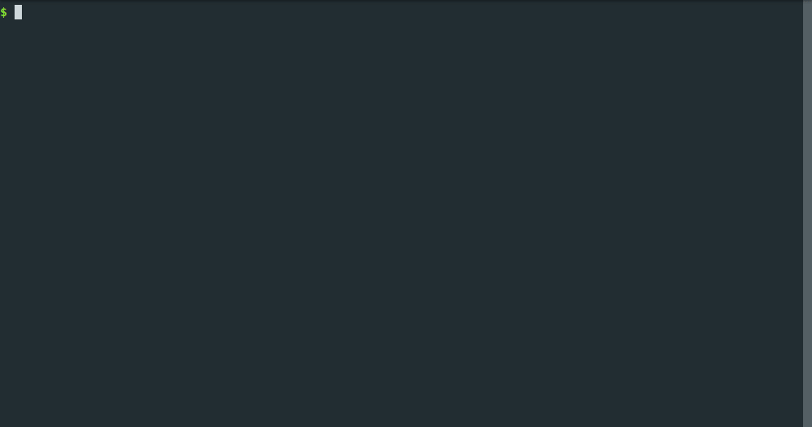

# Tool Quickstart

Setting up DANE for a first time should be relatively straightforward, we'll get you collecting some network traffic data in no time.

To use the tool: make sure you have the requirements, download the code, build the Docker images locally, then specify your configuration for desired network conditions and behaviors.

If you're interested in how the tool works, see [How It Works](approach.md). To look at the source code, see [https://github.com/dane-tool/dane](https://github.com/dane-tool/dane).

## Requirements

DANE supports Windows, Mac, and Linux as long as the current version of Docker is available.

- [Docker 19.03+](https://docs.docker.com/get-docker/)
- [Docker Compose 1.27+](https://docs.docker.com/compose/install/)
- [GNU Make](https://www.gnu.org/software/make/)

```tip
- For Mac, I recommend using Homebrew to `brew install make`
- For Windows, I recommend using [GitBash](https://git-scm.com/downloads) as your terminal and using Chocolatey to `choco install make`
```
```note
If you are using Windows you must use the Hyper-V backend for Docker. Since WSL2 lacks support for network emulation (see [WSL issue #6065](https://github.com/microsoft/WSL/issues/6065)) and Windows Home does not have access to Hyper-V, Windows Home is not supported.

On Windows, you must go to Docker Desktop settings > General and enable "*Expose daemon on tcp://localhost:2375 without TLS*".
```

## Getting Started

### Download the tool

First we need to download DANE:
```bash
git clone \
https://github.com/dane-tool/dane.git \
--recursive
```

### Configuration

It's time to specify what kind of client behaviors and network conditions we want to see!

Open up the `config.json` file and set the list of behaviors to your desired client behaviors. Try "ping", "streaming", or "browsing" to use some of our built in starting behaviors. Or, write a custom script and run it by specifying "custom/filename.py".

Set the list of condition objects to have your desired number of networks and desired latency and bandwidth in each network as "_ms" and "_Mbit" values.

Specify if you want your clients to connect a VPN and the desired VPN server.

```note
Many VPNs cause a bit of extra latency or reduced bandwidth, so your achieved conditions with a VPN enabled may differ slightly from your configuration.
```

Your final config file should look similar to the following example, which ultimately produces four containers, two each in a "good" and "bad" network:
```json
{
    "behaviors": [
        "browsing",
        "streaming"
    ],
    "conditions": [
        {
            "latency": "20ms",
            "bandwidth": "50Mbit"
        },
        {
            "latency": "200ms",
            "bandwidth": "5Mbit"
        }
    ],
    "vpn": {
        "enabled": true,
        "server": "<your VPN provider"
    },
    "system": {
        "shared_memory_size": "2gb",
        "use_local_images": false
    }
}
```

```tip
Any configured conditions which are better than the conditions of your home network will fall back to the conditions of your home network.

DANE is pretty magical, but it won't be able to create an internal network which exceeds your own local conditions!

If you'd like to configure a network to have the same conditions as your home network, you can configure values like "0ms" and "999Mbit". 
```

### Environment file (secrets)

The containers will need secret variables that store things like VPN or website login credentials.

Please create a file named `.env` and place it in the 'dane' directory. You can easily create an empty file with a 'touch' command:
```bash
touch .env
```

Inside the file, add the login information for your VPN if you have `vpn.enabled: true` in your config.

```
VPN_USERNAME=<your username>
VPN_USERGROUP=<the login group for VPN access>
VPN_PASSWORD=<your password>
```

## Running

Once you're satisfied with your configuration, simply open a terminal to this directory, and run

```bash
make
```

```note
If you're using a VPN with 2-Factor Authentication, you'll need to authorize the connection for each of the clients as they connect!
```

When you're done collecting data, open a new terminal in this directory and run

```bash
make stop
```

## Data

After the tool has been stopped, data can be found in `data/`.

## Example


