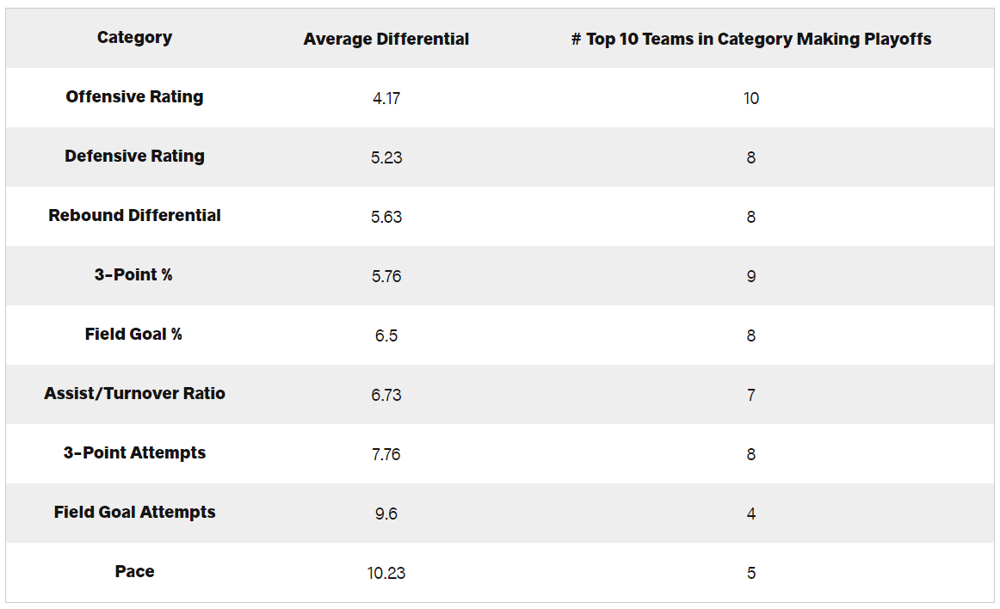
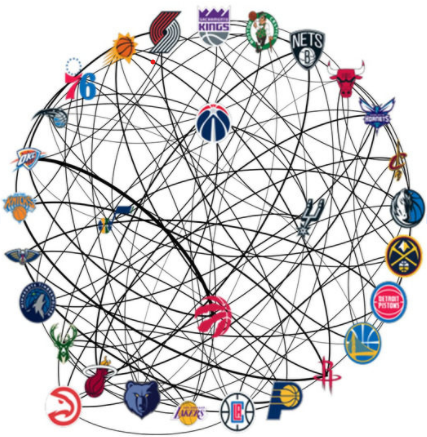
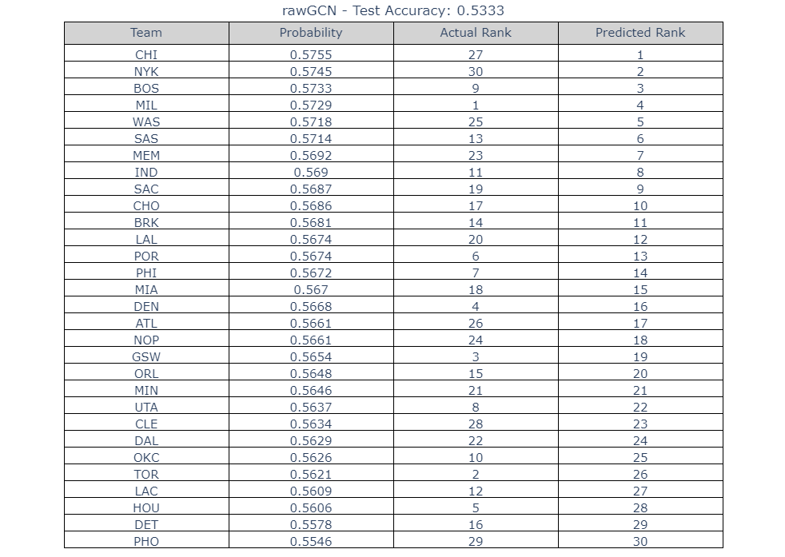
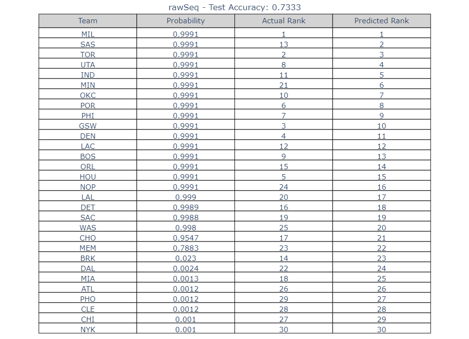
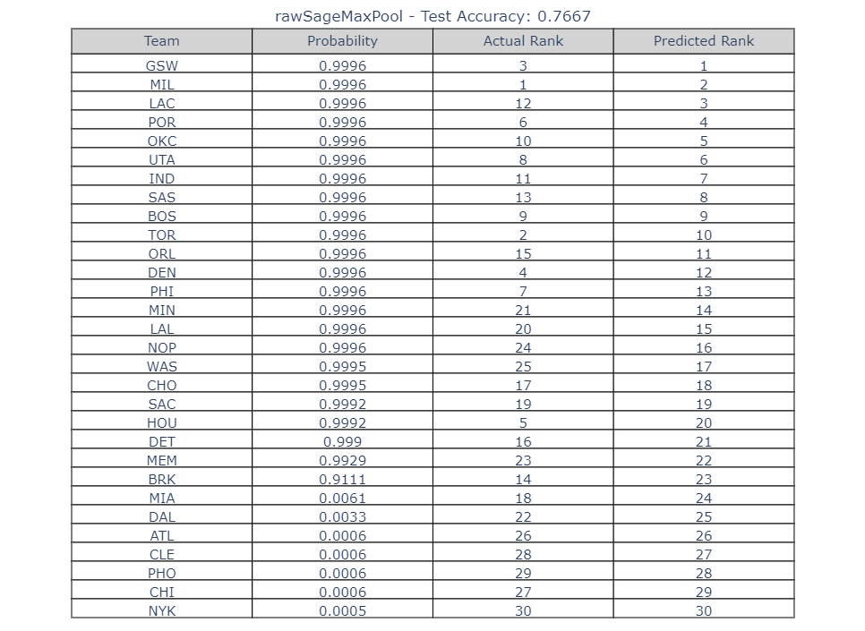
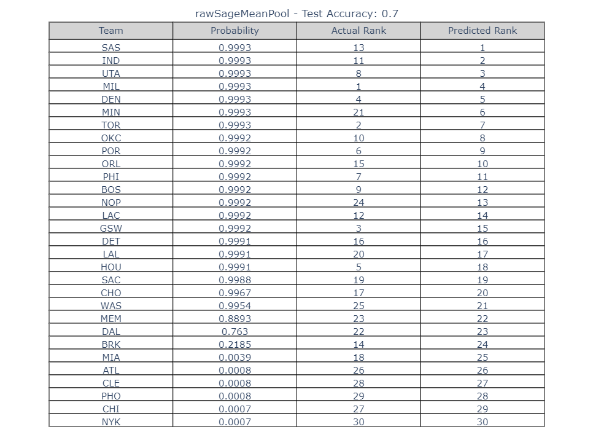
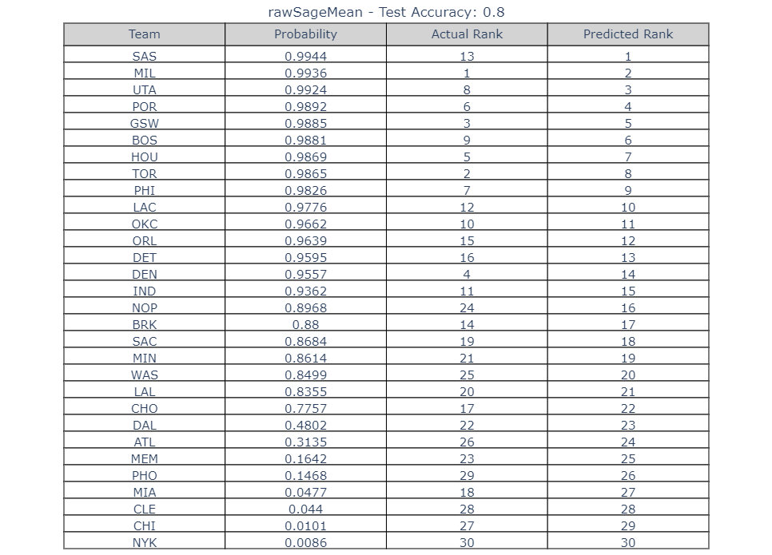
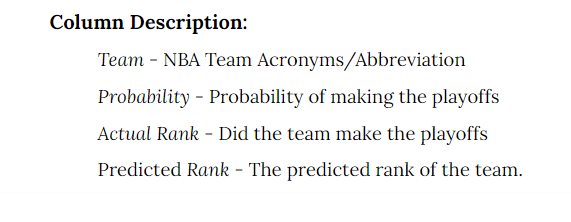
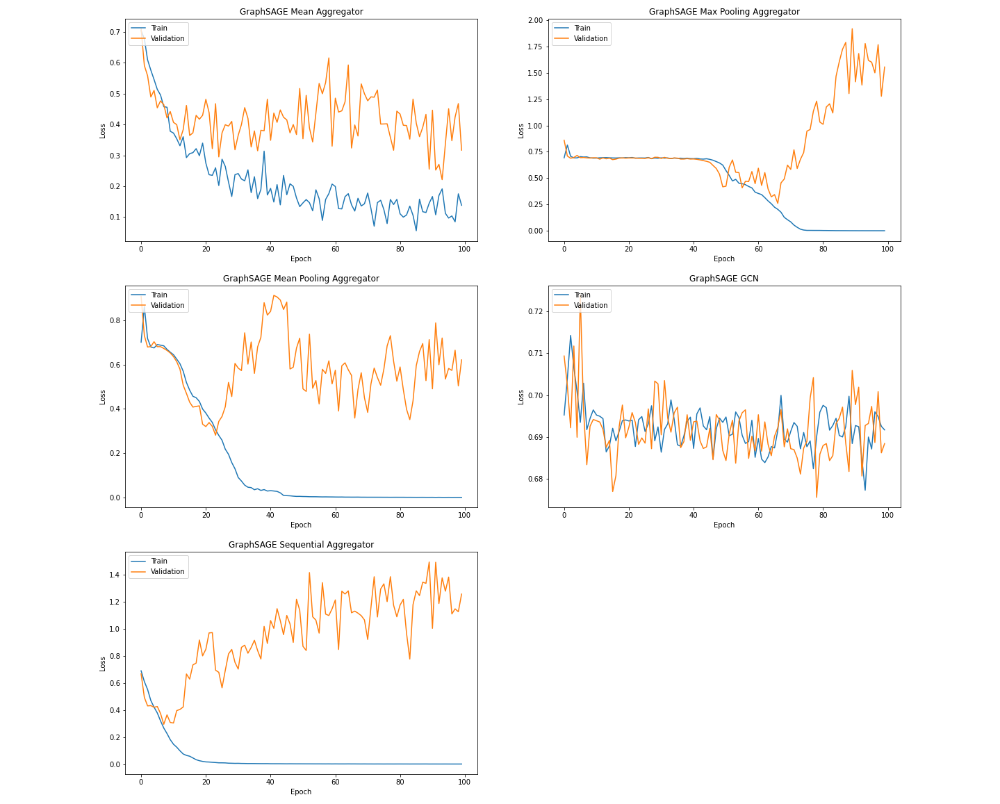
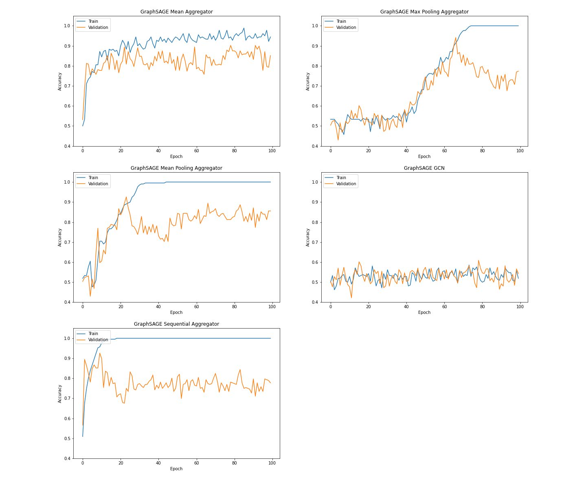

#  NBA Rankings with Graph Neural Networks
## by Steven Liu and Aurelio Barrios

- The NBA is one of the most popular sports in the United States with **63 million viewers**.
- The structure of the NBA resembles a graph and thus can be best represented with Graph Neural Networks.
- Using Graph Neural Networks, we will be able to make predictions of the ranking of each team.
- We believe that the accuracy of the Graph Neural Network model would be better than the [_current models_](https://fivethirtyeight.com/features/introducing-raptor-our-new-metric-for-the-modern-nba/).

# What's wrong with Prior Work?
- [**FiveThirtyEight**](https://fivethirtyeight.com/tag/nba/) is a popular analytics website that has their own NBA ranking prediction model called RAPTOR.
- It specifically mentions that the model doesn't account for wins and losses of each team.
- The projection is entirely based on an estimate of each player's future performance based on other similar NBA players.
- RAPTOR doesn't look at the relationship between teams, which is the primary advantage our model will have.

# Why predict NBA Rankings?

Source: [https://watchstadium.com/which-nba-statistics-actually-translate-to-wins-07-13-2019/](https://watchstadium.com/which-nba-statistics-actually-translate-to-wins-07-13-2019/)
- Here, we can see what teams need to achieve to become one of the top 10 teams in the NBA.
- Within sports and the NBA, **statistics are crucial because they can tell you how well you are doing and what you are best or worst at**. 
- Our model will be able to determine the impact of the changes made in a team's ranking. 
- This can help give direction to where you or your team needs to improve.

# Why Graph Neural Networks (GNNs)?
 

- Most sports, such as the NBA, we can expect competitors to perform differently depending on who they're up against.
- The NBA regular season consists of the 81 games, and teams do not play each other the same number of times.
- This means that the **ranking of the team can be influenced by the schedule that their given that season**.
- Incorporating the regular season schedule within our model will allow us to capture the performance of each team with their unique match up.
- You can express the number of times each team plays each other with a weighted graph.
- This is why Graph Neural Networks work, and they are also one of the few models that can take advantage of this structure.

# What's our data?

- The data we will be using will be **individual player statistics, team rosters, and team schedules from the last 10 seasons**.
- All the data will be webscraped from [https://www.basketball-reference.com/](https://www.basketball-reference.com/]).
- After web scraping the data, we cannot directly input it into our model.
- We will need to develop a data pipeline to preprocess it for our Graph Neural Network!

# Which Graph Neural Network?
- There are many GNNs in the field, but the one we will use is GraphSAGE.
- GraphSAGE is a framework for inductive representation learning on large graphs.
- The steps of GraphSAGE are:

- There are multiple techniques to aggregate the feature information from neighbors, such as mean, mean-pooling, max-pooling, and sequential.
- GraphSAGE is scalable to node attributes, thus we will be able to experiment with as many features as we'd like for our player stats.
- Each node in our graph network will be a team, which will consist of the aggregate of all player stats on the team's roster. 
- Thus an input of GraphSAGE will require the use of the **player statistics** and **team rosters**, the feature matrix.
- To determine the neighbors of the graph network we will use the **team schedules**.
- This will be our second input of GraphSAGE, the adjacency matrix.
- With this, we can take advantage of all GraphSAGE has to offer!

# What are we doing?
- **We will be inputting player stats, team rosters, and team schedules into our GraphSAGE model to output the ranking for each team.**
- The model will use NBA data from seasons 2010-2018 to predict the rankings of 2019.

# Challenges & Solutions
1) Scraping our own data was difficult. Stats were hidden under an on-hover button, which we couldn't access.
   - We were able to find a third-party scraper to get the data we needed. Thanks to [https://pypi.org/project/basketball-reference-scraper/)](https://pypi.org/project/basketball-reference-scraper/).

2) We were obtaining extremely low accuracies with the GraphSAGE model.
   - We thought our implementation of GraphSAGE was incorrect, so we decided to use the author's at [https://github.com/twjiang/graphSAGE-pytorch](https://github.com/twjiang/graphSAGE-pytorch). This did not change anything. 
   - This was mainly due to the model's loss function penalizing wrong predictions too much.
   - Making predictions that are close to the correct seeding should be okay. 
   - To combat this, instead of the labels being from 1-30 for each team, we decided to make them from 0-1, whether the team made it to the playoffs or not. 
   - This reduces the influence of the loss function and we were able to obtain good results!
 
3) However our goal isn't to predict whether teams make it to the playoffs, it is to predict their actual rankings!
   - To do this, we had to modify the output of the GraphSAGE model.
   - Instead of outputting labels, we had the model output the probabilities for each label.
   - We then used the probabilities as the ranking for each team.
   - It was a success, still able to obtain good results.
   
4) All the model told us was what accuracy, it is all useless unless we know exactly what teams were placed where.
   - The model outputs the data exactly how it is inputted.
   - If we join the input and output by index, we will have the correct teams for each probability. Solved.
   

# Our Results!
- This section contains the results using **10 NBA seasons** to predict the rankings of teams in **2019**.
- It will **compare the performances of each GraphSAGE aggregator** as well the traditional Graph Convolutional Network as a benchmark.

 <b>Model Test Accuracies 100 Epochs</b> 

:-------------------------:|:-------------------------:
  |  
  |  
  |  

 - We can see that GraphSAGE is able to obtain better accuracies than the traditional GCN.
 - Looking deeper, we can see that the best aggregator for our model would be the mean.
 - The model is able to obtain **80% accuracy with room for improvement** which will be discussed in the conclusion.

  
 <b> Model Loss </b> 

  
  
  
  
 <b> Model Accuracy </b> 

  
  
  - By analyzing both the model accuracies and losses across the epochs, we were able to determine how effective the model is learning.
  - It gives us an idea of whether the loss function is a problem which **helped us discover that we needed to make our labels binary**.

  
 <b> # of Training Seasons Performance </b> 

  
  
  - Assuming that the rankings of the teams have a drastic change every 5 or so years, we wanted to see how many seasons we should include when training. 
  - For validating as well because we believe that the most recent years of the NBA would be the most important for our model!
  - It seems that the **more number of seasons in training, the better our test accuracy** will be.

# Conclusion!
   To conclude, we were able to develop a model that can produce predictions of the NBA Rankings with 80% accuracy. This means that there will be around 6 teams that would be misranked. We are satisfied with our accuracy, but there is definitely further research that can be done to improve the model. As stated earlier, the validation seasons are crucial to the test set, but when using them as our validation, we weren't able to use them in our training. Incorporating the validation seasons into the training would be extremely helpful. We have not been able to test the full effects of the aggregators as they take a long time to run, it is possible to obtain better results with these aggregators after applying the changes. 
   
# Thanks for reading!

