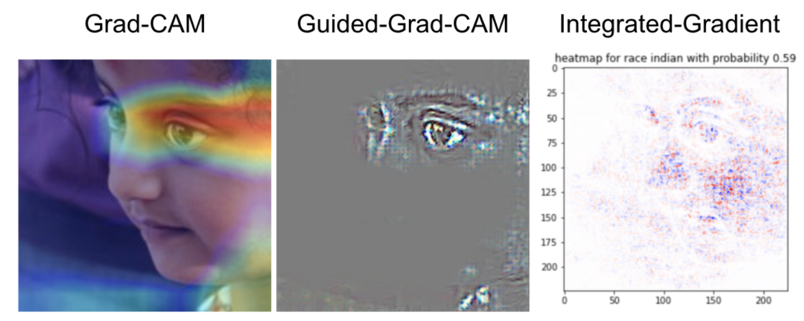

# Racial_Classification_XAI_Model

keyword: Deep Learning, Convolutional Neural Network, Integrated-Gradient, Grad-CAM, Web Application

Website: https://michael4706.github.io/XAI_Website/

Static Web app: this [demo](https://nicole9925.github.io/facial-analysis-frontend/) (once you clicked the demo, just press submit to run it) is our web application that runs sample image. Make sure you visit the [Web Application](https://michael4706.github.io/XAI_Website/webapp/) (or just click this link) to play with it. If you want to run the web application with your own image, please visit the Web Application section below and follow the intrusctions.

### Introduction
This project is about visualizing Convolutional Neural Network (CNN) with XAI techniques: Grad-cam and Integrated-Gradient. We used the FairFace dataset to train our models. This dataset contains about 80000+ training images and 10000+ validation images. The dataset contains three different categories(labels): age range(9 classes), race(7 classes), and gender(2 classes). We implemented a model that combined the first 14 layers from resnet50 as pre-trained layers with our self-defined layers. We trained three models on each of the different categories using the same model structure except changing the number of outputs from the final layer to match each category's number of classes. Then, we applied XAI to visualize models' decision-making with heatmaps. We want to examine what features or regions the models focus on given an image. Also, we are interested in comparing the heatmaps generated by the biased and unbiased models. The FairFace Dataset has an equal distribution of race. Therefore, we created a dataset with an unequal distribution of race and trained a biased model with this dataset.

##### config
* The parameters to run the scripts. Make sure to visit this file before running the code.

##### run.py
* script to train the model, run integrated-gradients, and calculate the statistics for the model.

##### src
* folder that contains the source code.

##### models
* Contained dlib_mod that helps to preprocess the images. You also recommend you to save your trained model here.

##### test_data
* Contains sample data from FairFace Dataset.

### How to run the code
1. please the my docker image: `michael459165/capstone2:new8` and run the code inside this container.
2. please go to the config file to change the parameters. This file has 5 sections, each corresponds to a set of parameters to execute a particular task.
3. Type `python run.py train_model` to train your model.
4. Type `python run.py generate_stats` to generate statistics and plots.
5. Type `python run.py run_test` to generate just ONE heatmap for both Integrated Gradient and Grad-CAM on the test sample. This will generate the heatmaps of the class with the HIGHEST predictive probability.
6. Type `python run.py run_custom_img` to generate just ONE heatmap for both Integrated Gradient and Grad-CAM on YOUR own image. This will generate the heatmaps of the class with the HIGHEST predictive probability.

Note: All the functions in util.py are well documented. Please feel free to explore and modify the code!

### Web Application
We also made a Web App to showcase our work. Please clone [this repository](https://github.com/nicole9925/facial-analysis-webapp) and follow the instruction to run it locally. If you want to deploy the Web App online, please visit [frontend](https://github.com/nicole9925/facial-analysis-frontend) and [backend](https://github.com/nicole9925/facial-analysis-backend) repositories for further instruction. 

### More stuff you can do
* If you don't want to train the model (because it takes a long time), then please visit the "temp" branch from this repository. There are trained models under the models folder and sample integrated-gradient results and statistics under the visualization folder. Please just download the files you need and run the code from this main branch. 

### Reference
[1]Selvaraju, Ramprasaath R., et al. "Grad-cam: Visual explanations from deep networks via gradient-based localization." Proceedings of the IEEE international conference on computer vision. 2017.

[2]Grad-CAM implementation in Keras[Source code]. https://github.com/jacobgil/keras-grad-cam.

[3]Sundararajan, Mukund, Ankur Taly, and Qiqi Yan. "Axiomatic attribution for deep networks." International Conference on Machine Learning. PMLR, 2017.

[4]Integrated Gradients[Source code]. https://github.com/hiranumn/IntegratedGradients.

[5]@inproceedings{karkkainenfairface,
      title={FairFace: Face Attribute Dataset for Balanced Race, Gender, and Age for Bias Measurement and Mitigation},
      author={Karkkainen, Kimmo and Joo, Jungseock},
      booktitle={Proceedings of the IEEE/CVF Winter Conference on Applications of Computer Vision},
      year={2021},
      pages={1548--1558}
    }

[6] FairFace: Face Attribute Dataset for Balanced Race, Gender, and Age[Source code].https://github.com/dchen236/FairFace.

[7] Draelos, Rachel. “Grad-CAM: Visual Explanations from Deep Networks.” Glass Box, 29 May 2020. https://glassboxmedicine.com/2020/05/29/grad-cam-visual-explanations-from-deep-networks/#:~:text=Grad%2DCAM%20can%20be%20used%20for%20understanding%20a%20model's%20predictions,choice%20than%20Guided%20Grad%2DCAM.
