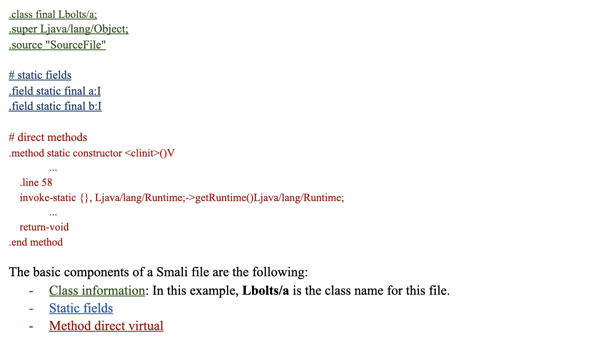
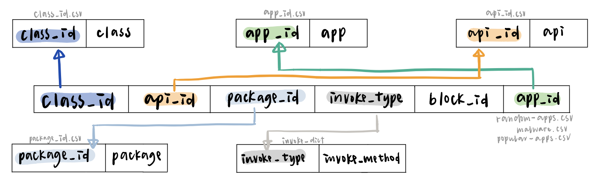
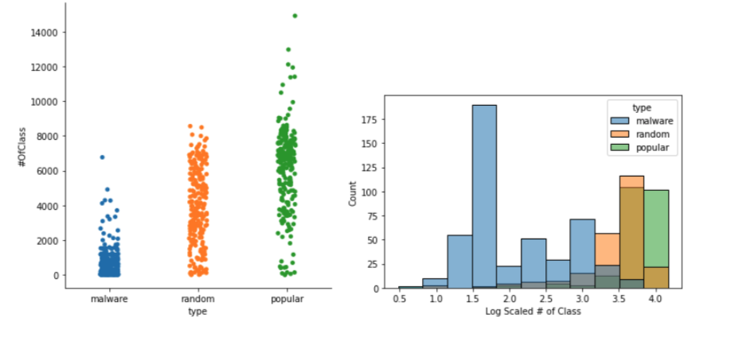
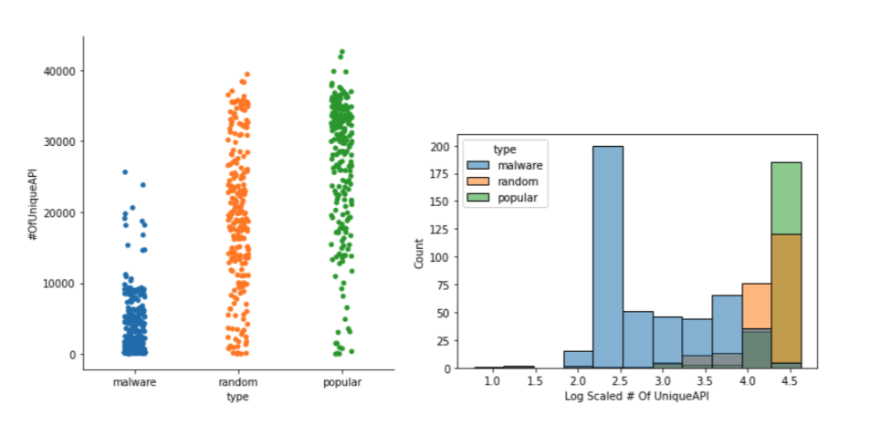
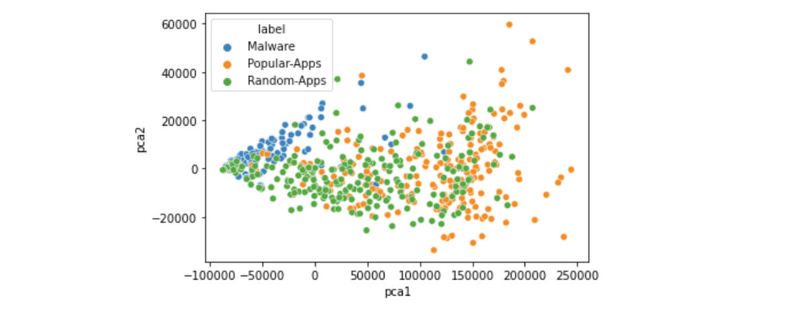
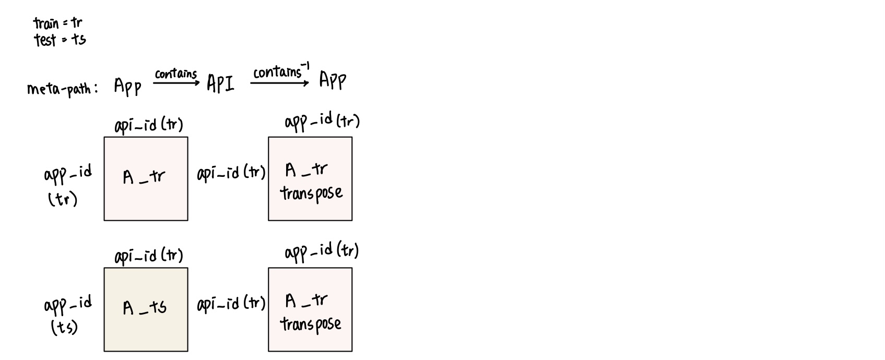
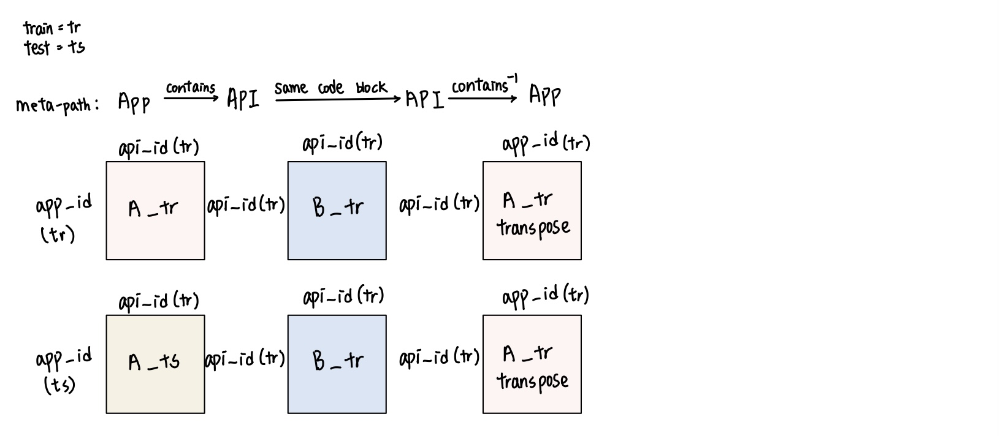
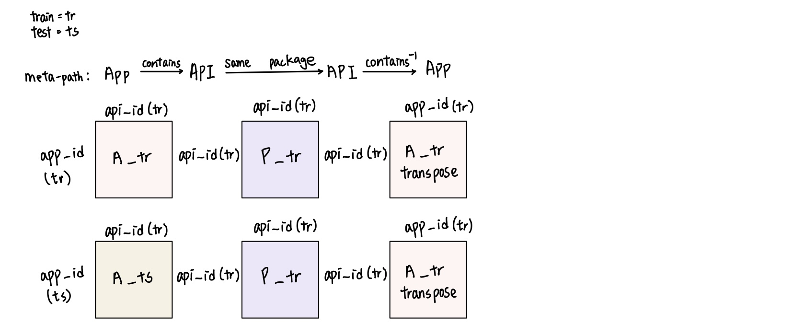
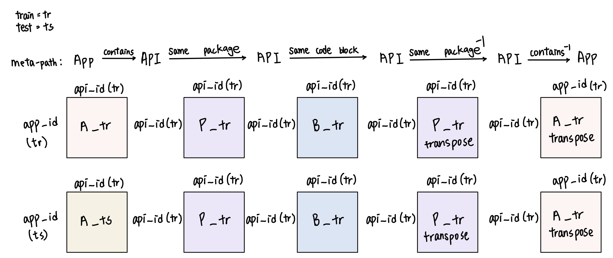

# HinDroid Report

Authors: [**Yikai Hao**](https://github.com/YikaiHao), [**Yu-Chieh Chen**](https://github.com/yuc399), [**Ruoyu Liu**](https://github.com/rul141)

## Introduction 
With more people starting to use cellphones and storing their information on cell phones, it is important to protect user’s information. The Android system is the most widely used mobile operating system which takes part of 80% of the market. Since the Android environment is open source, everyone is able to upload their apps and let users try on their apps. This leads to a severe problem of malwares on the Android system. Malwares are split into multiple categories - trojans, adware, etc. Each type of malware has different performance, they might send out messages unconsciously, steal the user's information, or lock down the phone until the user pays the ransom.

With the development of the market, there already exist lots of methods to detect malwares. There are two main detection methods in industry now. Static analysis asks professional security coders to check the code and decide whether it is a malware or not. On the other hand, dynamic analysis puts the apps in an isolated environment to check its behaviour. However, both methods have some constraints. Static analysis requires professional coders also have lots of experience in the security domain and dynamic analysis might ignore lots of malwares like timed malware. With the development of technology, people start to think about using the machine learning techniques on malware detection based on the source code of the applications. In order to detect the malware at the earlier stage, we try a new method called HinDroid which analyzes the code of apps and detects malware by checking the apis they used and the relationships between apis. We first extract the features we want from the smali files and then build the matrices which represent the relationships between apis and apps. By building different kernels using SVM (support vector machine), we will be able to detect malwares based on the similarity between two apps. If we are able to detect the malware at the earlier stage, we can future collaborate with third party app stores to detect the apps before they are published. In this way, we will be able to benefit millions of users.

## Data 
In order to detect malware, we need to understand the code from Android apps. Android apps are written in Java, compiled to Dalvik bytecode, and distributed in apk (Android Application Package) files. In order to analyze the code, we decompile these Android Apk files (.dex) into readable Smali code using **ApkTool**.

The dataset that is being investigated includes three types of apps, including malware, random, and popular apps. There are 4963 apps in malware-apps, 234 apps in random-apps, and 325 apps in popular-apps. In the malware apps, there are 22 different malware types.

The original dataset comes from Android Malware Dataset (AMD), which is a dataset published in 2017 by the Argus Lab from the University of South Florida. Since lots of other research papers about malwares use the same dataset, it is an appropriate dataset to use. However, since the smali file contains lots of other information, we will do some data generating process to extract the features we need.

## Smali File
To analyze code in the Smali file, we need to understand the structure of it. The following code is a sample Smali file from Microsoft Word app.

## API Call
To understand the key features of malware, we focus on the API (Application Programming Interface) calls in the Smali files. The following is an example of the API call which has four main components.

## Data Generat Processing 
We have a source which divides applications into three categories - popular apps, random apps, and malware. We extract features from the source which appropriately represent the data. The invoke method, api name, the method, and the return type fully represent most of the features in an API. In addition, we also saved the names of the APIs, the block numbers, which shows whether the APIs are in the same code block, and the types of the app. Therefore, we can find some relationships among APIs from those data. These data can help us to determine the relationship between different apps. Also, it helps us to construct the A, B, and P matrix to conclude apps contain the suspicious api calls to be malware. We format a .py file which is written in Python to get the values we want. (additional information about .py files in Appendix) In order to reduce the space we take up and the run time, we also make some optimizations on code.

By using the type of the app as the label in future models, we will be able to find the relationships between the apps, and check the similarities between apps. This will help us find the malware.

## Database 
We design a special database to store the data we get. Since our main feature is the api, there are over 2 millions unique apis and more than 50 millions apis appeared in different smali files. In order to save space and time, we use separate csv files to store different unique string values. Instead of using string, we assign an unique id to each string to represent the string value. Then, in the main csv files, we store the unique ids from different references. This will reduce the space and time. The description of our database is appended below.

## Data Statistics 

| Type | Mean of Number of API Being Called Once  | Sum of Number of API Being Called Once | Number of API | Number of  Class | Number of APP |
|:------------- |:-------------|:-------------|:-------------|:-------------|:-------------|
|Malware|0.01|159.10|2393.25|406.21|464|
|Popular|0.02|2625.55|26937.55|6123.47|232|
|Random|0.01|1098.03|19719.85|3896.35|232|

464 malwares, 232 popular apps, and 232 random apps are used as source of data generating process. Malware type contains malicious code. Popular apps are the ones having top downloads. Random apps are the benign apps randomly selected from the app store. The table shows some statistics we generated from the data. The api column represents the number of unique apis in an app. According to the HinDroid policy, api here means the combination of api and package. The class column talks about the number of classes in an app, which can also be considered as the number of smali files in an app. In addition, we also calculate the apis only being called once in each type and their average among apps. The statistics confirmed our idea that the size of malwares is much smaller than other apps. The number of unique apis other apps have is around 10 times than malware, such difference also exists when we compare the number of classes. 

# Methods 

## Baseline
### Summary of Features

The baseline model includes the following features for each app:

| Column Name      | Dtype          |Nominal /Ordinal /Quantitative  | Encoding Method |
|:------------- |:-------------| :-----|:-----|
| number of public methods | `int` | Quantitative | StandardScaler |
| number of protected methods | `int` | Quantitative | StandardScaler |
| number of private methods | `int` | Quantitative | StandardScaler |
| number of code blocks | `int` | Quantitative | StandardScaler |
| number of system apis | `int` | Quantitative | StandardScaler |
| number of string apis| `int` | Quantitative | StandardScaler |
| number of invoke methods | `int` | Quantitative | StandardScaler |
| number of unique apis | `int` | Quantitative | StandardScaler |

### EDA 
The graph shows the spread of the number of classes in an app, which can also be understood as the number of smali files in an app. As the graph shows, malwares are condensed together around 0 - 2000. On contrast, random apps and popular apps are more widely spread. In addition, popular apps contain some outliers which have really large numbers. By taking a closer look at the specific number, malwares dominate the range of 0 - 2000. Most of the random apps are in the range 2000 - 7000. Outliers of popular apps are mostly located at the range > 7000.

Then take a look at the number of unique apis. Those graphs look really similar to previous graphs. Malwares still condense at the small number area. Popular apps and random apps are more widely spread over the graph with some outliers. More specifically, malwares often contain 0 - 10000 unique apis. Random apps are mainly located in range 10000 - 25000. Popular apps dominate the range > 25000. Combining the conclusion we get from previous graph and statistics, we reinforce the idea that malwares have a size way smaller than other apps.

We use PCA to transform the above features into 2 dimensions. We plot the PCA graph to see if three categories have clear differences in lower dimension. As we can see from the graph, green dots and orange dots are mainly overlapped. It is reasonable since both random apps and popular apps are considered as 'good' apps. For malwares, although part of them are overlapped with other apps, they mostly lie near y = 0 and their x value are always smaller than 0. So there are some features that can be used to split malwares and other apps.

### Estimator and Hyperparamter
We choose three models: Support Vector Machines(SVM), Random Forest Classifier (RF), and Gradient Boosting Classifier (GB) and use `GridSearchCV` to find the optimal hyperparameters for them.

    
| Model | Parameters | 
|:------------- |:-------------|
| SVM | pca__n_components = 0.99, C = 100, gamma =  1, kernel = rbf|
| RF | pca__n_components =  0.99, max_depth =  None, min_samples_split = 3, n_estimators = 50|
| GB | pca__n_components =  0.99, loss = deviance, max_depth = 8, min_samples_split = 7, n_estimators = 100|

### Model Performance

Both **accuracy** and **f1 score** are used as our evaluation method, because in a real android system, there are more benign apps than malware apps. Moreover, both false negatives (malware apps are ignored) and false positives (benign apps are identified as malware) should be eliminated. Therefore, the f1 score may provide more information than accuracy.

| Model | Accuracy (avg)| F1 Score (avg) 
|:------------- |:-------------|:-------------|
|SVM|0.950|0.947|
|RF|0.985|0.985|
|GB|0.981|0.980|

## HinDroid

Hindroid [1] uses a structured heterogeneous information network (HIN) to present the relationship between the apps and APIs. In it, it defines four matrices. Matrix A checks whether an app has a specific API call. Matrix B pairs up the two APIs and checks whether they appeared in the same block of code. Matrix P checks if two APIs have the same package. Matrix I checks if two APIs use the same invoke method. Matrix A and B are used to generate the following kernels to determine malware.  

### Kernel Introduction 
- AA

The meta-path is APP -(contains)->  API -(contains^-1)-> APP.

The items in AA represent the number of how many apis are shared between two apps. 

- ABA

The meta-path is APP -(contains)-> API -(same code block)-> API -(contains^-1)-> APP

The items in ABA represents the number of paired apis in the same code block that are shared between two apps.

- APA 

The meta-path is APP -(contains)-> API -(same package used)-> API -(contains^-1) -> APP

The items in APA represent the number of paired apis in the using the same package between two apps.

 - APBPA
 
 
 
 The meta-path is APP -(contain)-> API -(same package)-> API -(same code block)-> API -(same package^-1)-> API -(contains^-1) -> APP

The items in APBPA represents the number of paired apis using the same package and in the same code block shared between two apps.

### Kernel EDA

- AA

The following is the statistics of the AA. With 371 malware training apps, there is an average of 246.62 common API calls for each two malware apps. With 371 benign training apps, there is an average of 4313.74 common API calls existing in the two different benign apps. Between 371 benign and malware apps, there is average of 653.62 common API calls in one malware and one benign apps.

|   | Malware |   Benign  |
|:--------:|:--------:|:------:|
| Malware |  246.62  | 653.62 |
| Benign |  653.62  | 4313.74 |

- ABA

The following is the statistics of the ABA. With 371 malware training apps, there is an average of 124,255.61 APIs within the same block of code that are shared between two malware apps. With 371 benign training apps, there is an average of 1,773,303.29 common API calls existing in the two different benign apps sharing in the same block. Between 272 benign and malware apps, there is average of 501,874.6 common API calls sharing by the same block in one malware and one benign apps. 

|   | Malware |   Benign  |
|:--------:|:--------:|:------:|
| Malware |  124255.61  | 501874.60 |
| Benign |  501874.60 | 1773303.29 |

- APA

The following is the statistics of the APA. With 371 malware training apps, there is an average of 5327.35 APIs within the same block of code that are shared between two malware apps. With 371 benign training apps, there is an average of 155,380.07 common API calls existing in the two different benign apps sharing in the same block. Between 272 benign and malware apps, there is average of 23,390.14 common API calls sharing by the same block in one malware and one benign apps. 

|   | Malware |   Benign  |
|:--------:|:--------:|:------:|
| Malware |  5327.35  | 23390.14 |
| Benign |  23390.14  | 155380.07 |

### Model Performance

- AA

|  | Accuracy | F-1 | Precision | Recall | Number of Apps |
|:--------:|:--------:|:------:|:--------:|:------:|:------:|
| Training | 1.0 | 1.0 | 1.0 | 1.0 | 742 |
| Testing | 0.9677 | 0.9655 | 0.9655 | 0.9655 | 186 |

AA accurately categorizes malware and benign apps in training data. It scores 96.77% on testing accuracy and 0.9655 on F-1 score. 

- ABA

|  | Accuracy | F-1 | Precision | Recall | Number of Apps |
|:--------:|:--------:|:------:|:--------:|:------:|:------:|
| Training | 0.9407 | 0.9415 | 0.944 | 0.9390 | 742 |
| Testing | 0.8602 | 0.8506 | 0.8506 | 0.8506 | 186 |

ABA receives worse on both training and testing statistics comparing to the AA ones.

- APA

|  | Accuracy | F-1 | Precision | Recall | Number of Apps |
|:--------:|:--------:|:------:|:--------:|:------:|:------:|
| Training | 1.0 | 1.0 | 1.0 | 1.0 | 742 |
| Testing | 0.9624 | 0.9605 | 0.9444 | 0.9770 | 186 |

APA also accurately categorized malware and benign apps in training dataset. It scores slightly lower accuracy and F-1 score comparing to AA kernel. However, it has higher testing recall score than other kernels. 

- APBPA

|  | Accuracy | F-1 | Precision | Recall | Number of Apps |
|:--------:|:--------:|:------:|:--------:|:------:|:------:|
| Training | 0.9218 | 0.9253 | 0.8997 | 0.9523 | 742 |
| Testing | 0.8602 | 0.8488 | 0.8588 | 0.8391 | 186 |

APBPA has the lowest statistics comparing to other kernels. 

- **Comparison**

|  Dataset | Accuracy |   F-1  | Precision | Recall |
|:--------:|:--------:|:------:|:--------:|:------:|
|  AA |  0.9677  | 0.9655 | 0.9655 | 0.9655 |
|  ABA |  0.8602  | 0.8506 | 0.8506 | 0.8506 |
|  APA |  0.9624 | 0.9605 | 0.9444 | 0.9770 |
|  APBPA |  0.8602 | 0.8488 | 0.8588 | 0.8391 |

Using the same dataset where training set contains 742 apps and testing set contains 186 apps, AA outperforms other kernels in both **accuracy** and **f1 score**. However, APA performs the best on **recall score**. 

# Reference

[1] Hou, Shifu and Ye, Yanfang and Song, Yangqiu and Abdulhayoglu, Melih. 2017. HinDroid: An Intelligent Android Malware Detection System Based on Structured Heterogeneous Information Network. 

# Appendix

- Description of .py file for data generation process
    - util.py 
        - `list_flatten (function)`: It is a function that used to flatten the nested list 
        - `unique_id _generator (class)`: It is a class which assigns an unique id to different values with the same category. It will also save the id and value pair into a csv file.
           - instance variables: next_id, output_path, name, id_dict 
           - `get_id_dict(function)`: It is a function that gets self.id_dict.
           - `add(function)`: It is a function that adds new items into the dictionary.
           - `save_to_csv(function)`: It is a function that save id_dicr into csv file.
    - make_dataset.py
        - `smali_data (function)`: It is a function that searches for all the smali files in one application. It takes in a file path which is a path to a certain app and returns a dictionary of smali files' path. 
        - `find_app_address (function)`: It is a function that gets all file paths of apps.
        - `stat_lst (function)`: It is the most important function which helps us extract the features we want. We go into the smali files and extract the features step by step. The most outer information we get is class name and code block. Then, in each class and code block, we search for apis and invoke method's type. We store each type of information in their own array. 
        - `stat_df (function)`: It is a function that combines different arrays we get from stat_lst into a dataframe and then save them into a csv file. It is separated by different categories of app
        - `clean_df (function)`: It is a function that combines some shared features of apps together. For example the class name, api name, etc.

    - build_features.py
        - `preprocess_csv(class)`: preprocess csv files for the construction of A, B, P matrix. 
            - instance variables: output_path, df, train, test, y_train, y_test
            - `_load_csv (function)`: It is a function that loads the dataset csv file and saves the column of types.
            - `_reconstruct_ids(function)`: It is a function that builds new ids for api calls and code blocks 
            - `_train_test_split(function)`: It is a function that splits the original dataset into training dataset and testing dataset. 
            - `_train_test_y(function)`: It is a function that loads training labels and testing labels.
            - `_save_y(function)`: It is a function that saves both the training and testing labels. 

        - matA(class): construct matrix A 
            - instance variables: train, test, y_train, y_test, output, df, X_train, X_test 
            - `_reset_id(function)`: It is a function that resets app_id, block_id, and package_id for training and testing dataset and makes them start form 0. 
            - `_construct_csr_train_mat(function)`: It is a function that constructs the A training matrix.
            - `_construct_csr_test_mat(function)`: It is a function that constructs the A testing matrix.
            - `_save_train_test(function)`: save both A_training and A_testing matrix. 

        - matB(class): construct matrix B
            - instance variables: train, output, X_train
            - `_construct_csr_train_mat(function)`: It is a function that constructs the B training matrix.
            - `_save_train_test(function)`: save both B_training matrix. 

        - matP(class): construct matrix P
            - instance variables: train, output, X_train
            - `_construct_csr_train_mat(function)`: It is a function that constructs the P training matrix.
            - `_save_train_test(function)`: save both P_training matrix. 
            
    - run_model.py
    
        - `model(class)`: generate SVM model and record result of AA, ABA, APA, and  APBPA kernels
           - `_load_matrix(function)`: It is a function that load the npz files and save it in the class
           - `_load_y(function)`: It is a function that loads the label of the apps 
           - `_kernel_func(function)`: It is a function that returns the kernel function for a specific metapath 
          - `_construct_kernel(function)`: It is a function that returns a list of lambda functions corresponding to the input metapath list
          - `_evaluate(function)`: It is a function that trains the model and records the statistics for each kernel.
          - `_save_output(function)`: It is a function that saves the result dataframe into the server. 
        - `run_model(function)`: it is a function that creates the model object and runs all the functions 

