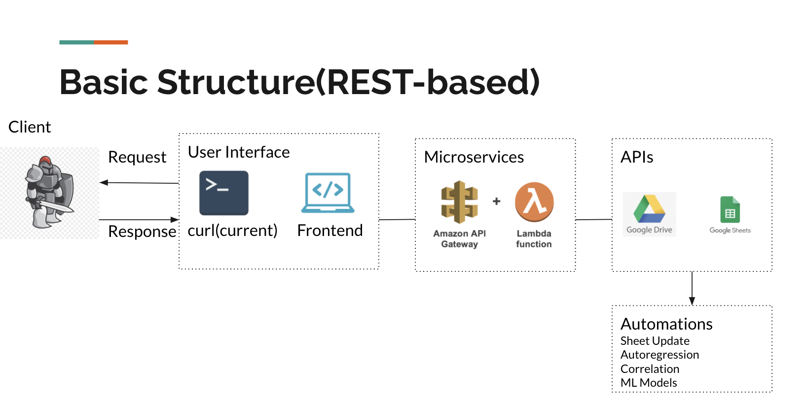

## Project MAI
### Project Description
MAI refers to Microservice-based Auto Infrastructure, a serverless architecture.
This project aims to build a lightweight, effective, and robust system that helps with the automations of several workflows of the campus COVID detection team.

### Underlying Architecture

### Supported Functions
#### AUM(auto-update microservice)
1. Automate excel parsing => cross-reference => update the sheet 
2. All in one script(rewrote excel parse used to parse raw cases data)
3. One upload and a POST request
4. Improved code quality
for more information, go to [repository](https://github.com/CrisZong/AUM)

#### statsTool
1. Prediction (autoregression model by buildings)
2. Autocorrelations (autocorrelation by building)
3. Stats(Cases by building sorted by number of cases)
for more information, go to [repository](https://github.com/CrisZong/statsTool)

#### Manhole Graph
the project supports creating a graph of the manhole downstream that can be consumed by the campus notification team and running standard graph routines for paths searching or manipulations.

#### Functions for graph
To build a graph and see the resulting csv, please run `python run.py graph`

### Dataset
The data used was provided by the Knight Lab team. One data source is the daily wastewater data on the Google Spreadsheet. The other data source is the network folder which contains all the shape files about sewer and manhole connections on campus.

